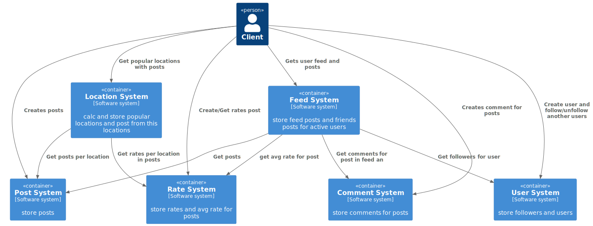
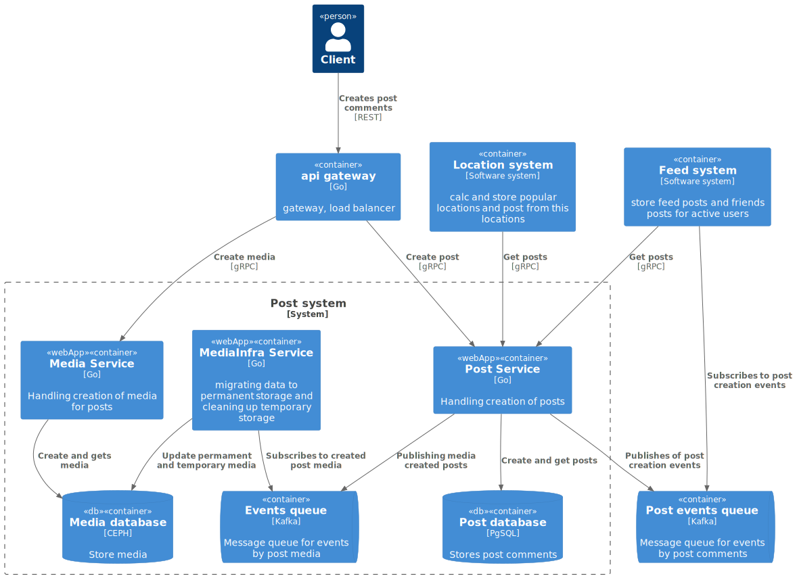
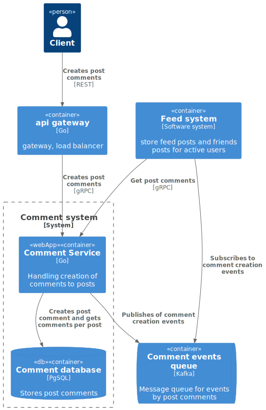
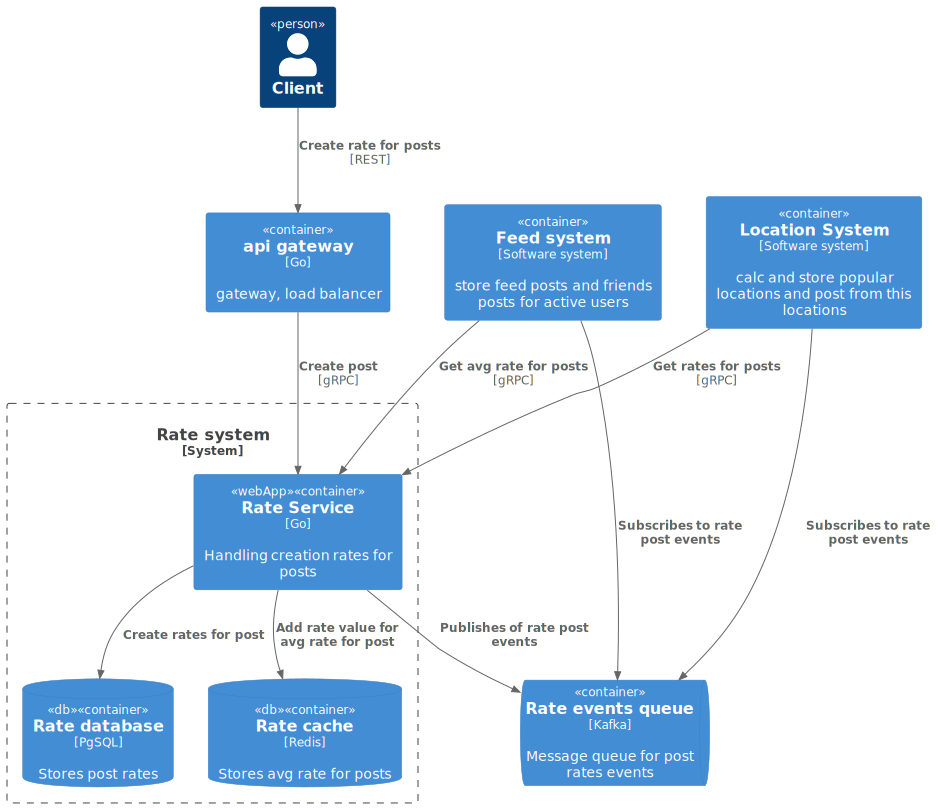
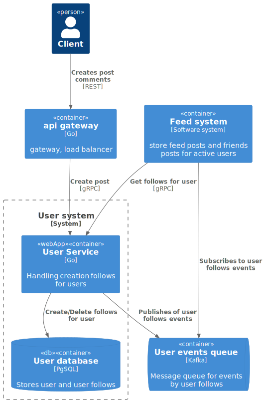
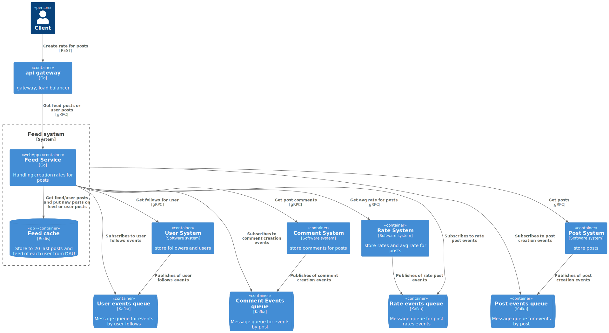
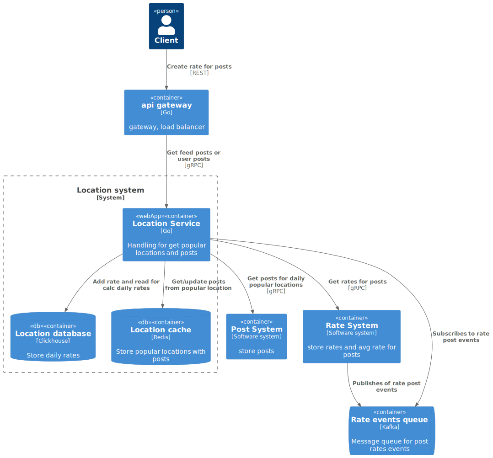

# Social network for travelers
Homework for [course by System Design](https://balun.courses/courses/system_design). 
A social network with browsing popular destinations, publishing posts 
and subscribing to other travelers.

### Functional requirements:

* create posts from travels with location
* post commenting
* view comments for post
* post rating
* subscribe to travelers
* view subscription posts
* browsing popular locations
* view posts from a specified location
* view traveler feed
* the user chooses the location for the post from a map

### Non-functional requirements:

*  linear growth during the year to 10 000 000 DAU
*  we plan to have 100 million unique users in total
*  on average each user has 50 subscriptions
*  only 15 percent of users make posts, each averaging 2 posts each
*  only 30 percent of users rate posts, each averaging 5 posts per day
*  only 5 percent of users comment posts, each averaging 3 posts per day
*  all users view an average of 15 posts per day
*  availability 99,99%
*  CIS region of use
*  always keep the data (posts, comments, rates)
*  maximum number of subscriptions 1000, maximum number of subscriptions per day 50 
*  maximum number of ratings per day 100
*  maximum number of comments per day 30
*  average number of comments per post 10
*  mobile and web versions
*  the list of popular places should be updated once a day (based on rates)
*  comments post should reach in 3 seconds
*  post evaluations should be delivered in 3 seconds
*  in summer and on big calendar weekends, a 30 percent increase in user activity
(create posts, comments, rates and reading content) 
*  subscription feed in reverse chronological order
*  the subscription feed should be updated in 5 seconds
*  1000 characters limit for post
*  3 image limit for post
*  maximum image size 1 Mb

## Design overview

     <b>Level 1.</b> System context diagram  

  

     <b>Level 2.</b> Post system container diagram  

 

  

     <b>Level 2.</b> Comment system container diagram  

 

  

     <b>Level 2.</b> Rate system container diagram  

 

  

     <b>Level 2.</b> User system container diagram  

 

  

     <b>Level 2.</b> Feed system container diagram  

 

  

     <b>Level 2.</b> Location system container diagram  

 

  

## Load estimation

### subsystem Post

RPS (write):

    DAU = 10 000 000
    on average, 15 percent of users publish 2 posts per day
    RPS = 10 000 000 / 86400 * 0.15 * 2 ~= 35
    RPS in season ~= 35 + 35 * 0.5 ~= 55

RPS (read):

    DAU = 10 000 000
    users view an average of 15 posts per day
    RPS = 10 000 000 / 86400 * 15 ~= 1740
    RPS in season ~= 1740 + 1740 * 0.5 ~= 2610

Size for posts table:

    post_id - 16 bytes
    author_id - 16 bytes
    location_latitude - 8 bytes
    location_longitude - 8 bytes
    location_name - 50 * 2 ~= 100 bytes
    timestamp - 8 bytes
    description - 1000 * 2 ~= 2000 bytes
    media = metadata url in db = 3 elem * 2 * 260 bytes(len url) ~= 1560 bytes
    Total ~= 3.7 Kb

Size for media in s3 for post:
    
    image - 1 Mb
    Total = 3 * 1 Mb = 3 Mb

Traffic:
    
    media 
    (write) 3 Mb * 35 ~= 105 Mb/s
    (read) 3 Mb * 1740 ~= 5.3 Gb/s
    
    post
    (write) 3.7 Kb * 35 ~= 130 Kb/s
    (read) 3.7 Kb * 1740 ~= 6.3 Mb/s

Required memory for posts and media:

    Created posts for 1 year = 10 000 000 * 15% * 2 * 365 = 3 000 000 * 365 post/year
    Each post size ~= 3.7 Kb
    Each post media size ~= 3 Mb
    Required memory for 1 year for posts = 3 000 000 * 3.7 Kb * 365 ~= 3.8 Tb
    Required memory for 1 year for images from posts = 3 000 000 * 3 Mb * 365 ~= 78 * 365 Tb ~= 3.1 Pb

Disk evaluation for posts in db:

    Capacity = 3.8 Tb
    conditional traffic = 130 Kb/s + 6.3 Mb/s = 6.4 Mb/s
    iops = 1740 + 35 = 1775

    Disks_for_capacity = 3.8 Tb / 2 Tb = 1.9
    Disks_for_throughput = 6.4 Mb/s / 500 Mb/s = 0.0128
    Disks_for_iops = 1775 / 1000 = 1.775
    Disks(HDD) = max(ceil(1.9), ceil(0.0128), ceil(1.775)) = 2

    Use 2 * SSD (SATA) 2 Tb

Disk evaluation for media in db:

    Capacity = 3.1 Pb
    conditional traffic = 105 Mb/s + 5.3 Gb/s = 5.5 Gb/s
    iops = 1740 + 35 = 1775

    Use SSD Sata 100TB
    Disks_for_capacity = 3.1 * 1024 Tb / 100 Tb = 31.74
    Disks_for_throughput = 5.5 Gb/s / 500 Mb/s = 11.264
    Disks_for_iops = 1775 / 1000 = 1.775
    Disks(HDD) = max(ceil(31.74), ceil(11.264), ceil(1.775)) = 32

    Use 32 * SSD (Sata) 100TB

Host evaluation for post:

    Hosts = 2 / 2 = 1
    Hosts_with_replication_2 = 2 * 1 = 2

* Since traffic and rps are not large for post service, it makes sense to put the entire master base in one host.
  An excessive number of hosts will make it harder for us to interact with them,
  and there is no need for load balancing yet

Host evaluation for media:

    Hosts = 32 / 4 = 8
    Hosts_with_replication_2 = 8 * 3 = 24

* Given that the bandwidth is about 1gb/s, we need 5.5gb of traffic from 6 hosts. 
* Given 32 memory disks, we need a minimum of 8 hosts, then there will be 4 disks per host

### subsystem Comment

RPS (write):

    DAU = 10 000 000
    on average, 5 percent of users comment 3 posts per day
    RPS = 10 000 000 / 86400 * 0.05 * 3 ~= 18
    RPS in season ~= 18 + 18 * 0.5 ~= 27

RPS (read):

    DAU = 10 000 000
    average number of comments per post 10
    RPS = 10 000 000 / 86400 * 10 ~= 1160
    RPS in season ~= 1160 + 1160 * 0.5 ~= 1740

Size:

    post_id - 16 bytes
    author_id - 16 bytes
    comment - 500 * 2 byte = 1000 bytes
    timestamp - 8 bytes
    Total ~= 1040 bytes

Traffic:

    (write) 1040 bytes * 18 = 18.3 Kb/s
    (read) 1040 bytes * 1160 ~= 1.2 Mb/s

Required memory:

    Created comments for 1 year = average_number_of_comments_per_post * count_posts_per_year = 
        10 * 3 000 000 * 365 = 30 000 000 * 365
    Each comment size ~= 1040 bytes ~= 1 Kb 
    Required memory for 1 year = 30 000 000 * 365 * 1 Kb ~= 365 * 28.6 Gb ~= 10.19 Tb

Disk evaluation for comment in db:

    Capacity = 10.19 Tb
    conditional traffic = 18.3 Kb/s + 1.2 Mb/s = 1.3 Mb/s
    iops = 1160 + 18 = 1178

    Use SSD Sata 4 Tb
    Disks_for_capacity = 10.19 Tb / 4 Tb = 2.5475
    Disks_for_throughput = 1.3 Mb/s / 500 Mb/s = 0.0026
    Disks_for_iops = 1178 / 1000 = 1.178
    Disks(HDD) = max(ceil(2.5475), ceil(0.0026), ceil(1.178)) = 3

    Use 3 * SSD (Sata) 4TB

Host evaluation for comment:

    Hosts = 3 / 3 = 1
    Hosts_with_replication_2 = 1 * 2 = 2

* Since traffic and rps are not large, it makes sense to put the entire master base in one host.
    An excessive number of hosts will make it harder for us to interact with them, 
    and there is no need for load balancing yet
    

Required memory for posts with comments in cache:

    feed for DAU = 10 000 000 * 20 * (3.7 Kb + (1040 bytes * 10))~= 2.6 Tb
    last 20 posts from DAU = 10 000 000 * 20 * (3.7 Kb + (1040 bytes * 10)) ~= 2.6 Tb

### subsystem Rate

RPS (write):

    DAU = 10 000 000
    on average, 30 percent of users rate 5 posts per day
    RPS = 10 000 000 / 86400 * 0.3 * 5 ~= 175
    RPS in season ~= 175 + 175 * 0.5 ~= 260

Size:

    post_id - 16 bytes
    author_id - 16 bytes
    rate - 2 byte
    Total ~= 34 bytes

Traffic:

    (write) 34 bytes * 175 ~= 6 Kb/s

Required memory:

    Created rates for 1 year = 10 000 000 * 30% * 5 * 365 = 5 475 000 000
    Each rate size ~= 34 bytes 
    Required memory for 1 year = 5 475 000 000 * 34 bytes ~= 174 Gb

Disk evaluation for rate in db:

    Capacity = 174 Gb
    conditional traffic = 6 Kb/s
    iops = 175

    Use SSD Sata 256 Gb
    Disks_for_capacity = 174 Gb/ 256 Gb = 0.6796875
    Disks_for_throughput = 6 Kb/s / 500 Mb/s = 1.171875e-05
    Disks_for_iops = 175 / 1000 = 0.175
    Disks(HDD) = max(ceil(0.6796875), ceil(1.171875e-05), ceil(0.175)) = 1

    Use 1 * SSD (Sata) 256 Gb

Host evaluation for rate:

    Hosts = 1 / 1 = 1
    Hosts_with_replication_2 = 1 * 2 = 2

Required memory for aggregated rate for posts in cache:

    post_id 16 bytes
    avg_rate int 8 bytes
    count int 8 bytes
    total 32 bytes

    Memory for all posts for 1 year = 32 bytes * 3 000 000 * 365 post/year ~= 33 Gb

### subsystem User

Size user:

    id - 16 bytes
    username - 100 * 2 = 200 bytes
    created_at - 8 byte
    Total ~= 224 bytes

Size follows:

    following_user_id - 16 bytes
    followed_user_id - 16 byte 
    created_at - 8 bytes
    total ~= 40 bytes
    

Required memory:

    Each rate size ~= 34 bytes 
    Required memory for 100 million users = 100 000 000 * 224 bytes ~= 20.9 Gb
    Required memory for average 50 follows for 100 million users = 100 000 000 * 50 * 40 ~= 187 Gb
    Сapacity = user service 210 Gb

Disk evaluation for user:
 
    conditional traffic = 210 Gb / 86 400 / 365 = 7 Kb/s
    traffic(follow) = 187 / 86400 / 365 ~= 6.3 Kb/s
    
    iops(follow) = 6.3 Kb/s / 40 bytes ~= 162
    iops(create user) = 0.7 Kb/s / 224 bytes ~= 4

    Сapacity = 210 Gb
    Use SSD Sata 256 Gb

    Disks_for_capacity = 210 Gb / 256 Gb = 0.8203125
    Disks_for_throughput = 7 Kb/s / 500 Mb/s = 1.4e-05
    Disks_for_iops = 162 / 1000 = 0.162
    Disks = max(ceil(0.8203125), ceil(1.4e-05), ceil(0.162)) = 1
    
    Use 1 * SSD (Sata) 256 Gb

Host evaluation for user:

    Hosts = 1 / 1 = 1
    Hosts_with_replication_2 = 1 * 2 = 2

### subsystem Location

Memory for 1000 popular locations in cache:
    
    location - 16 bytes
    avg_rate - 8 byte

    1000 * 24 bytes = 23.4375 Kb

Memory for 1000 popular locations with 20 posts in cache:

    location - 16 bytes
    post - 3.7 Kb
    total ~= 3.8 Kb

    1000 * 20 * 3.8 Kb ~= 75 Mb

Memory for daily rates in cache:

    date 8 bytes
    post_id 16 bytes
    location_latitude 8 bytes
    location_longitude 8 bytes
    rate 8 bytes

    total ~= 48 bytes

    Daily rates = 10 000 000 * 30% * 5 = 15000000
    Daily Memory = 15000000 * 48 = 686.64 Mb
    
